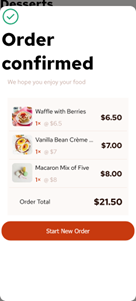

# Frontend Mentor - Product list with cart solution

This is a solution to the [Product list with cart challenge on Frontend Mentor](https://www.frontendmentor.io/challenges/product-list-with-cart-5MmqLVAp_d). Frontend Mentor challenges help you improve your coding skills by building realistic projects. 

## Overview

### The challenge

Users should be able to:

- Add items to the cart and remove them
- Increase/decrease the number of items in the cart
- See an order confirmation modal when they click "Confirm Order"
- Reset their selections when they click "Start New Order"
- View the optimal layout for the interface depending on their device's screen size
- See hover and focus states for all interactive elements on the page

### Screenshot

### Links

- Solution URL: [https://github.com/toshirokubota/product-list-with-cart.git](https://github.com/toshirokubota/product-list-with-cart.git)
- Live Site URL: [https://toshirokubota.github.io/product-list-with-cart/](https://toshirokubota.github.io/product-list-with-cart/)

## My process

### Built with

- Semantic HTML5 markup
- CSS custom properties
- Flexbox
- CSS Grid
- Mobile-first workflow
- asynchronous (promises, async/await) javascript

### What I learned

Through this project, I was able to practice asynchronous programming. I had to be mindful on how to design html and script 
so that the page is initialized without data and later populated with data. 

I also designed the project such that most items are created at the beginning and are hidden/unhidden (with display property) with the user interactions, instead of creating/deleting elements on the fly. I made the decision based on computational 
benefit of the former at the expense of more complicated scripting as a result, IMO. 

### Continued development

I have gotten more comfortable with layout, but I still need a lot of practice, in particular with flexbox and grid.

I am thinking about re-implementing this project using react. I feel that the library can help the design and implementation 
of the project. 

